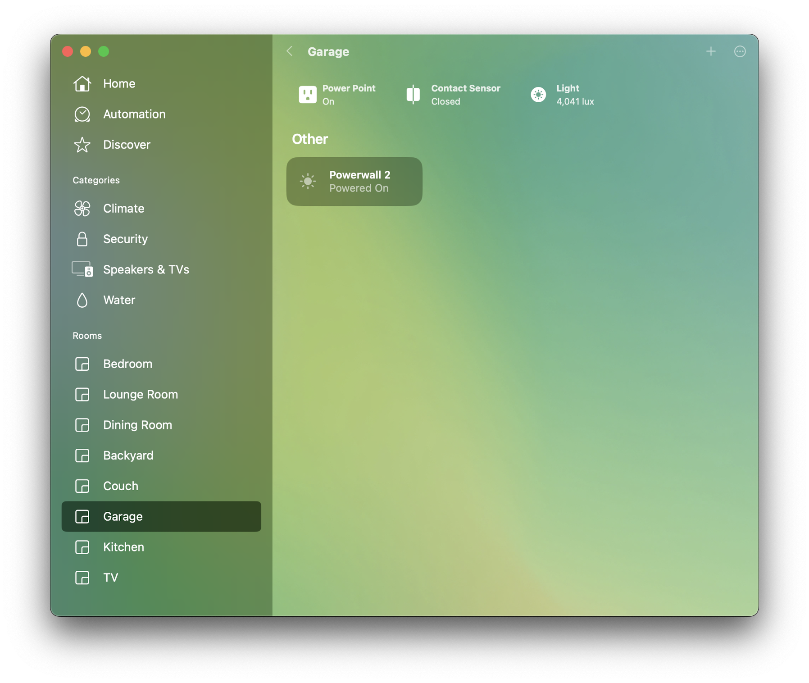
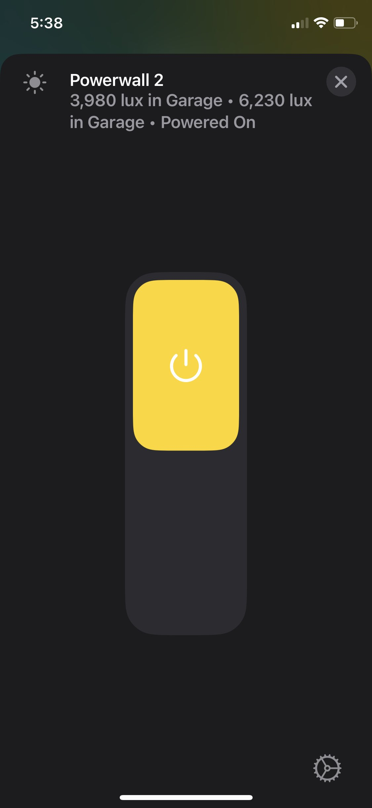
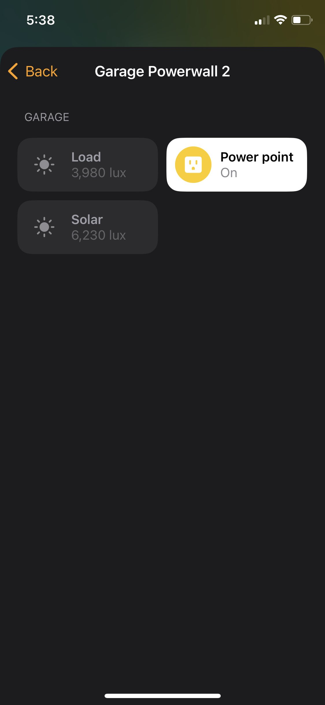
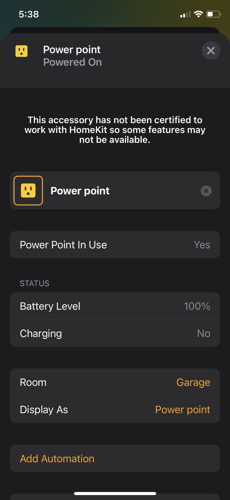
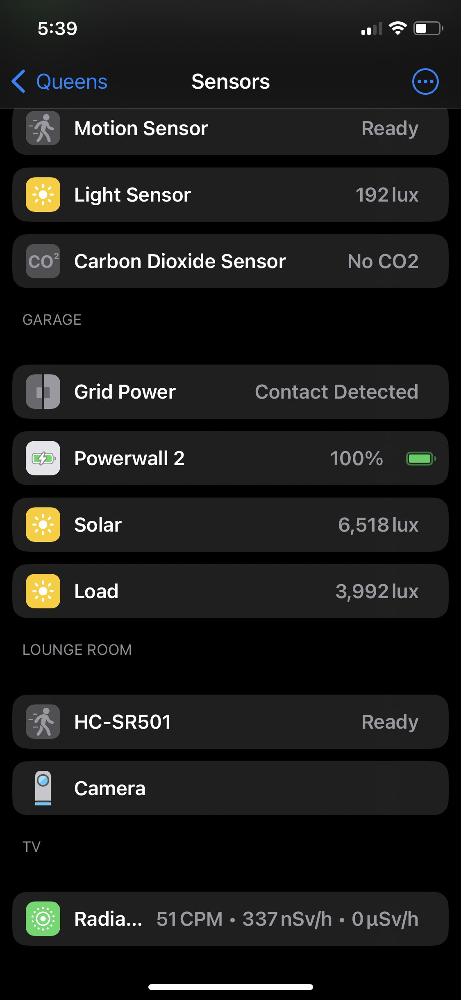
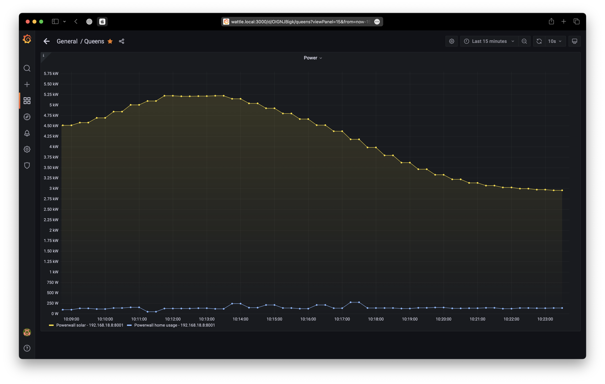

# HomeKit Tesla Powerwall 2

An Apple HomeKit accessory for the [Tesla Powerwall 2](https://www.tesla.com/en_au/powerwall).





## Software

* Install [Go](http://golang.org/doc/install) >= 1.14 ([useful Gist](https://gist.github.com/pcgeek86/0206d688e6760fe4504ba405024e887c) for Raspberry Pi)
* Build: `go build homekit-powerwall.go`
* Run: `go run homekit-powerwall.go -ip POWERWALL_IP -username YOUR_USERNAME -password YOUR_PASSWORD`
* In iOS Home app, click Add Accessory -> "More options..." and you should see "Tesla"

### Prometheus exporter

To export the `battery`, `load`, and `solar` for [Prometheus](https://prometheus.io) use the optional flag `-prometheusExporter`.



* Run: `go run homekit-powerwall.go -ip POWERWALL_IP -username YOUR_USERNAME -password YOUR_PASSWORD -prometheusExporter`

You'll then see the data on port `8001`: http://localhost:8001/metrics

```
# HELP battery Charge (%)
# TYPE battery gauge
battery 90

# HELP load Watt (W)
# TYPE load gauge
load 3980

# HELP solar Watt (W)
# TYPE solar gauge
solar 6230
```

## Powerwall setup

Follow the instructions in [Connecting to Tesla Gateway](https://www.tesla.com/en_au/support/energy/powerwall/own/connecting-network) to set your `username` and `password` for your Powerwall.

Then use these credentials to run this HomeKit exporter app.

## Thank you

* Powerwall module: [go-powerwall](https://github.com/foogod/go-powerwall)
* Powerwall HomeKit for hc: [powerwall-homekit](https://github.com/brianmario/powerwall-homekit)

## TODO

- [x] Update to use `hap` instead of `hc
- [ ] Add pull-request to the original repository
